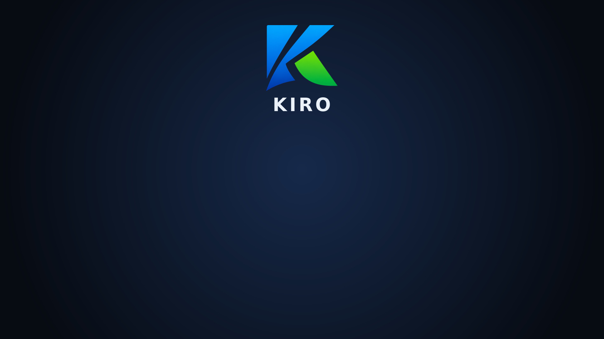

# kiro-grub-theme

Branded GRUB2 boot theme for **Kiro Linux** — a dark background with the Kiro
logo and a full set of OS icons for the boot menu entries.



## What it ships

Installed to `/boot/grub/themes/kiro/`:

- `theme.txt` — GRUB gfxmenu layout
- `background.jpg` — dark 1920×1080 background with centred Kiro logo + wordmark
- `icons/` — colour OS icons for boot-menu entries (arch, endeavouros, manjaro,
  windows, …) plus a custom **`kiro.png`** for the Kiro install entries
- `select_*.png` — selected-item highlight
- `*.pf2` — Terminus + Unifont bitmap fonts
- `info.png` — bottom hint bar

## Using it

Point GRUB at the theme in `/etc/default/grub`:

```
GRUB_THEME="/boot/grub/themes/kiro/theme.txt"
```

then `grub-mkconfig -o /boot/grub/grub.cfg`.

Boot-menu icons are matched by each entry's `--class` name to `icons/<class>.png`.
Use `--class kiro` on Kiro entries to show the Kiro icon.

## Credits / license

The OS icon set, selection pixmaps and `.pf2` fonts are taken from
[vinceliuice/grub2-themes](https://github.com/vinceliuice/grub2-themes)
(GPL-3.0). This package is likewise **GPL-3.0** — see [LICENSE](LICENSE).
The Kiro logo, wordmark and background composition are Kiro project artwork.
